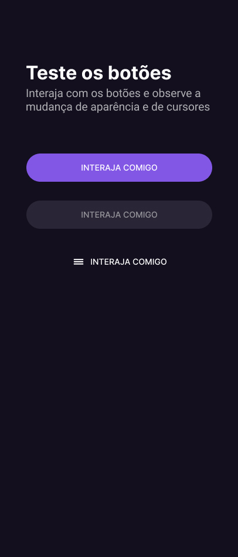

<h1 align="center"> DevLinks </h1>

Site para interações entre butões e cursores.  
<a href="https://youtube.com/watch?v=k6cb5MjdYVU&feature=shares">Estude esse projeto em formato de vídeo clicando aqui.</a>

  <a href="#-tecnologias">Tecnologias</a>&nbsp;&nbsp;&nbsp;|&nbsp;&nbsp;&nbsp;
  <a href="#-projeto">Projeto</a>&nbsp;&nbsp;&nbsp;|&nbsp;&nbsp;&nbsp;
  <a href="#-layout">Layout</a>&nbsp;&nbsp;&nbsp;|&nbsp;&nbsp;&nbsp;
  <a href="#memo-licença">Licença</a>

  

 

  

## 🚀 Tecnologias

Esse projeto foi desenvolvido com as seguintes tecnologias:

- HTML e CSS
- JavaScript
- Git e Github
- Figma

## 💻 Projeto

O DevLinks é um agregador de links para usar como cartão de visitas online.

- [Acesse o projeto finalizado, online](https://moraiisdev.github.io/bora-codar-3/)

## 🧠 Licença

Esse projeto está sob a licença MIT.

---

Feito com ♥ by Rocketseat e [MoraisDev](https://github.com/MoraiisDev)  